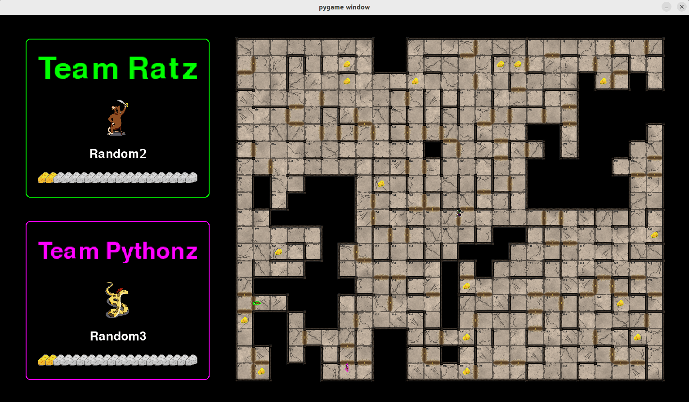

Install PyRat
=============

This section provides instructions on how to install the PyRat library and set up your workspace.
This is essential to start developing games using the PyRat API.
You can also find these installation instructions in the `README <https://github.com/BastienPasdeloup/PyRat>`_ file on the GitHub repository.

Prerequisites
-------------

- This installation procedure assumes that you have basic knowledge about shell manipulation.

- Also, it assumes that you have already created a virtual environment where to install PyRat.
  If not, please do this first as described in the `official documentation <https://docs.python.org/3/library/venv.html>`_.

- Finally, we will test PyRat installation using Visual Studio Code (VSCode), as this is the main tool we use in the associated course.
  Please make sure it is already installed, or install it from the `official website <https://code.visualstudio.com>`_.
  Note that you can use a different tool if you want, but we just provide indications for that one here.

Install the PyRat package
-------------------------

Installation of the PyRat software can be done directly using ``pip``.  
To do so, follow these steps:

1. Open a terminal.
2. Activate your virtual environment (change ``path_to_venv`` to the actual path):

     - **Linux:** ``source path_to_venv/bin/activate``
     - **MacOS:** ``source path_to_venv/bin/activate``
     - **Windows (cmd):** ``path_to_venv\Scripts\activate.bat``
     - **Windows (PowerShell):** ``path_to_venv\Scripts\Activate.ps1``

3. Install PyRat through ``pip`` as follows: ``pip install pyrat-game``

You should see something like this:

.. code-block:: text

     Downloading pyrat_game-6.0.0-py3-none-any.whl (4.2 MB)
          ━━━━━━━━━━━━━━━━━━━━━━━━━━━━━━━━━━━━━━━━ 4.2/4.2 MB 9.6 MB/s eta 0:00:00
     Installing collected packages: pyrat-game
     Successfully installed pyrat-game-6.0.0
     Your workspace is ready! You can now start coding your players and run games.

Setup your PyRat workspace
--------------------------

We are now going to create a workspace for PyRat.  
This is a directory that contains minimal working examples to get started.  
To do so, follow these steps:

1. Open a terminal, and navigate (use the ``cd`` command) to the directory where you want to create your PyRat workspace.
2. Activate your virtual environment where PyRat is installed (see above).
3. Run the following command:

     - **Linux:** ``python3 -c "import pyrat; pyrat.init_workspace('.')"``
     - **MacOS:** ``python3 -c "import pyrat; pyrat.init_workspace('.')"``
     - **Windows (cmd):** ``python -c "import pyrat; pyrat.init_workspace('.')"`` 
     - **Windows (PowerShell):** ``python -c "import pyrat; pyrat.init_workspace('.')"``

You should see something like this:

.. code-block:: text

     Workspace created in /path/to/pyrat_workspace
     Workspace added to Python path

Check your installation
-----------------------

Now, we are going to verify that PyRat works properly.  
To do so, follow these steps:

1. Open VSCode, and add your ``pyrat_workspace`` directory in your VSCode workspace.
2. Open the file ``sample_game.py`` in directory ``pyrat_workspace/games/``.
3. Make sure VSCode is using your virtual environment where PyRat is installed.
4. Run ``sample_game.py``.

You should see something like this:

Troubleshooting
---------------

- In case of a problem, please check the existing `GitHub issues <https://github.com/BastienPasdeloup/PyRat/issues>`_ first.

- If the problem persists, you can add an issue of your own.

- For students at IMT Atlantique, you can also ask your questions on the `Discord server <https://discord.gg/eMnFArZ8ht>`_ of the course.

- Finally, you can contact `Bastien Pasdeloup <mailto:bastien.pasdeloup@imt-atlantique.fr>`_ directly.