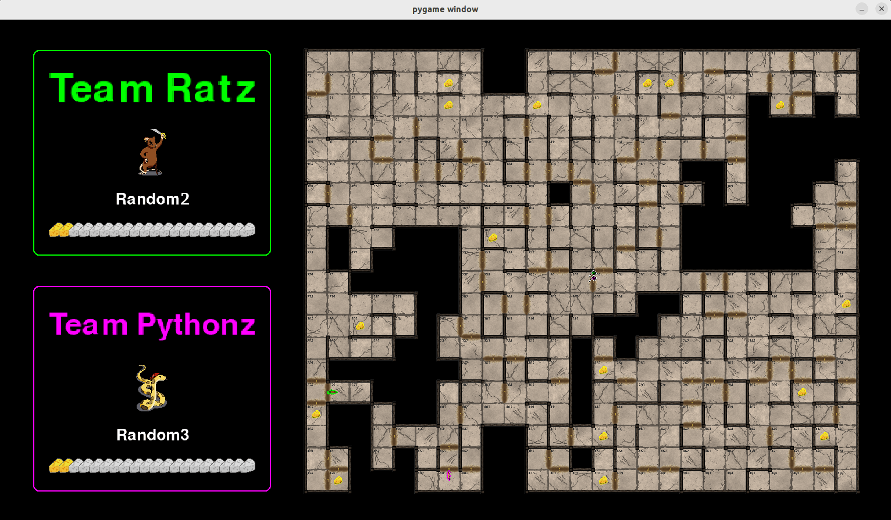

Install PyRat
=============

This section provides instructions on how to install the PyRat library and set up your workspace.
This is essential to start developing games using the PyRat API.
You can also find these installation instructions in the `README <https://github.com/BastienPasdeloup/PyRat>`_ file on the GitHub repository.

Prerequisites
-------------

- This installation procedure assumes that you have basic knowledge about shell manipulation.

- PyRat uses `uv <https://docs.astral.sh/uv>`_ to manage Python and the libraries it needs.
  You do not need to install Python yourself: uv takes care of it, and PyRat workspaces are configured to use Python 3.13 (Python 3.12 is also supported).

- Finally, we will test PyRat installation using Visual Studio Code (VSCode), as this is the main tool we use in the associated course.
  Please make sure it is already installed, or install it from the `official website <https://code.visualstudio.com>`_.
  Note that you can use a different tool if you want, but we just provide indications for that one here.

Install uv
----------

If uv is not installed on your machine yet, install it as follows:

     - **Linux:** ``curl -LsSf https://astral.sh/uv/install.sh | sh``
     - **MacOS:** ``curl -LsSf https://astral.sh/uv/install.sh | sh``
     - **Windows (PowerShell):** ``powershell -ExecutionPolicy ByPass -c "irm https://astral.sh/uv/install.ps1 | iex"``

Other installation methods are described in the `uv documentation <https://docs.astral.sh/uv/getting-started/installation>`_.
Then, close and reopen your terminal, and check that uv is available by running ``uv --version``.

Setup your PyRat workspace
--------------------------

We are now going to create a workspace for PyRat.
This is a directory that contains minimal working examples to get started, and in which PyRat is installed.
To do so, follow these steps:

1. Open a terminal, and navigate (use the ``cd`` command) to the directory where you want to create your PyRat workspace.
2. Run the following command, which is the same on all systems:

.. code-block:: shell

     uvx --from pyrat-game pyrat-init

You should see something like this:

.. code-block:: text

     Initialized project `pyrat-workspace` at `/path/to/pyrat_workspace`
     Workspace initialized as a uv project using Python >=3.12,<3.14
     Workspace created in /path/to/pyrat_workspace
     Using CPython 3.13.13
     Creating virtual environment at: .venv
     Resolved 19 packages in 132ms
     Installed 18 packages in 48ms
     PyRat added to the dependencies of the workspace
     Workspace added to Python path
     Your workspace is ready! You can now start coding your players and run games.
     To run a game, go to the workspace using 'cd pyrat_workspace', then use for instance 'uv run games/sample_game.py'.

You should have a new directory called ``pyrat_workspace`` in the directory where you ran the command.
If you prefer another name, pass it to the command, as in ``uvx --from pyrat-game pyrat-init my_workspace``.

Check your installation
-----------------------

Now, we are going to verify that PyRat works properly.
To do so, follow these steps:

1. Open a terminal, and navigate to your workspace using ``cd pyrat_workspace``.
2. Run the sample game as follows: ``uv run games/sample_game.py``.

You can also run your games from VSCode.
To do so, follow these steps:

1. Open VSCode, and add your ``pyrat_workspace`` directory in your VSCode workspace.
2. Open the file ``sample_game.py`` in directory ``pyrat_workspace/games/``.
3. Make sure VSCode is using the interpreter located in the ``.venv`` directory of your workspace.
4. Run ``sample_game.py``.

In both cases, you should see something like this:

Add other libraries to your workspace
-------------------------------------

Your workspace is a uv project, so you can add any library you need to it.
To do so, run ``uv add`` from your workspace, as in ``uv add numpy``.
The library is then available in your players and games, with no need to activate anything.

Use PyRat in an existing project
--------------------------------

PyRat is published on PyPI as the ``pyrat-game`` package, and requires Python 3.12 or 3.13.
If you already have a project and just want the PyRat library in it, add it as any other dependency:

     - **With uv:** ``uv add pyrat-game``
     - **With pip:** ``pip install pyrat-game``

You can then create a workspace from Python, which is equivalent to the ``pyrat-init`` command:

.. code-block:: python

     import pyrat
     pyrat.init_workspace()

Troubleshooting
---------------

- In case of a problem, please check the existing `GitHub issues <https://github.com/BastienPasdeloup/PyRat/issues>`_ first.

- If the problem persists, you can add an issue of your own.

- For students at IMT Atlantique, you can also ask your questions on the `Discord server <https://discord.gg/eMnFArZ8ht>`_ of the course.

- Finally, you can contact `Bastien Pasdeloup <mailto:bastien.pasdeloup@imt-atlantique.fr>`_ directly.
