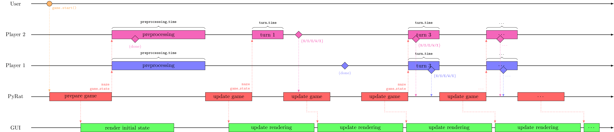
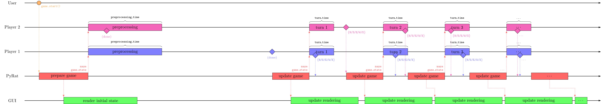
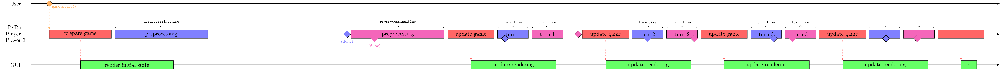
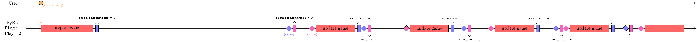

Choosing a Game Mode
====================

In PyRat, players compete against each other in a maze.
Therefore, each player can be seen as an independent program that interacts with the game.
To prevent cheating, players thus run in separate processes in parallel.
However, this consumes a lot of resources, so it is not always the best solution.
To address this, PyRat offers different game modes that allow you to choose how players interact with the game.
These modes can be set in the game settings using the ``game_mode`` argument.

By default, PyRat uses the following options:

- **Single-Team Game**: Sequential mode.
- **Multi-Team Game**: Match mode.

Match Mode
----------

The classic game mode is the **match mode**, which can be set using ``game_mode=GameMode.MATCH`` in the ``Game`` constructor.

It can be described by the following diagram (open in a new tab to zoom).
In this diagram, horizontal lines represent independent processes that run simultaneously on the computer.
Arrows represent communication between these processes.
The width of the various boxes represent the time it takes for the associated operation to complete, except for the preprocessing and turn boxes, that have a fixed duration (``preprocessing_time`` and ``turn_time``, respectively).
For these boxes, diamonds represent the moment when players end their computations.

.. image:: ../_static/match_mode.png

Note that the GUI (game interface) also lives in its own process.
If you close it, it will not interrupt the game, but will just stop rendering what happens.

In match mode, if a player takes more time than attributed in a phase, it will skip turns until its computations are done.
This can happen both in the preprocessing phase (the other players may then start walking before the late player), or at each turn.
Even if late at some point, all players will always receive up to date information on the game.

This is summarized with the following diagram.
In this example, Player 1 was so slow during preprocessing that it has to skip two turns.
Player 2 ended preprocessing in time and could thus perform its turn 1 normally.
However it took too much time there and had to skip turn 2.

Synchronous Mode
----------------

In synchronous mode (``game_mode=GameMode.SYNCHRONOUS``), the game will wait that all players have taken their decisions before applying them.
Preprocessing and turn phases still have a fixed time, but players can go over it and turns will not be skipped.

This translates in the following diagram.
With the same timing issues as in the previous example, we can see that the behavior of the PyRat game is not the same.

Sequential Mode
----------------

In sequential mode (``game_mode=GameMode.SEQUENTIAL``), multiprocessing is disabled.
All operations are done one after the other, and timing misses are treated as in synchronous mode.
The interest of this mode is that it accelerates computations, as isolating players in separate processes can cause a computation overhead.

In the following diagram, we observe that players are running in the same process as the PyRat game.
Note that the GUI is still running in its own process though.
Arrows between PyRat and players are omitted for readability.
Still, note that players receive the same information, and that they move simultaneously in the maze.
Only the decision making process is sequential.

Simulation Mode
---------------

Finally, the simulation mode should be used when you are running many PyRat games and want them to complete as fast as possible.
setting ``game_mode=GameMode.SIMULATION`` is strictly equivalent to setting options ``preprocessing_time=0.0``, ``turn_time=0.0``, ``game_mode=GameMode.SEQUENTIAL`` and ``render_mode=RenderMode.NO_RENDERING`` when creating the game.

The resulting diagram is as follows.
Rectangles indicate the start of the phase, and diamonds the end of computations.
Contrary to the sequential mode, there is no GUI anymore, and turns will start as soon as all players are ready.

