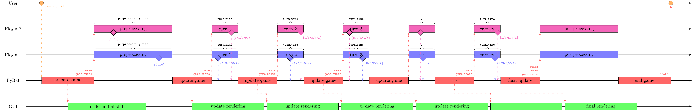

Choosing a Game Mode
====================

In PyRat, players compete against each other in a maze.
Therefore, each player can be seen as an independent program that interacts with the game.
To prevent cheating, players thus run in separate processes in parallel.
However, this consumes a lot of resources, so it is not always the best solution.
To address this, PyRat offers different game modes that allow you to choose how players interact with the game.
These modes can be set in the game settings using the ``game_mode`` argument.

Match mode
----------

The standard game mode is the **match mode**, which can be set using ``game_mode=GameMode.MATCH`` in the ``Game`` constructor.

It can be described by the following diagram (open in a new tab to zoom).
In this diagram, horizontal lines represent independent processes that run simultaneously on the computer.
Arrows represent communication between these processes.
The width of the various boxes represent the time it takes for the associated operation to complete, except for the preprocessing and turn boxes, that have a fixed duration (``preprocessing_time`` and ``turn_time``, respectively).
For these boxes, diamonds represent the moment when players end their computations.

