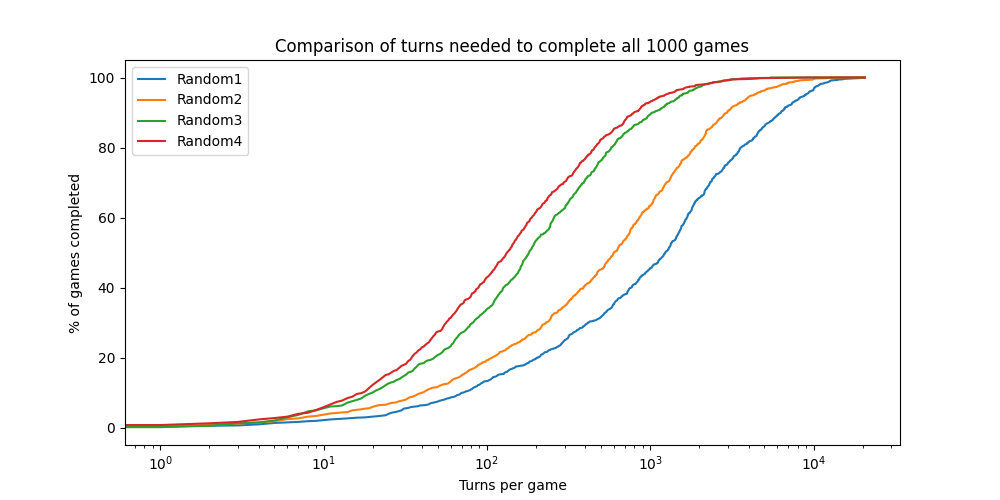

The Random Programs
===================

The PyRat workspace comes with four players that make random moves: ``Random1``, ``Random2``, ``Random3``, and ``Random4``.
In this tutorial, we will go through the code of these players to understand how they work.
In a next tutorial, we will see how to write a new player, based on what we learned here.

Getting Started
---------------

Open your VSCode workspace and navigate to the ``players`` directory.
In addition to the ``TemplatePlayer`` class, that we already mentioned in the :doc:`overview </overview>`, you will find the following files:

- :doc:`Random1 </workspace/players/Random1>`
- :doc:`Random2 </workspace/players/Random2>`
- :doc:`Random3 </workspace/players/Random3>`
- :doc:`Random4 </workspace/players/Random4>`

We also provide in the ``games`` directory a script that visualizes the behavior of these players in a game.
We will not go through this script in details, but you can find it here:

- :doc:`visualize_random_players </workspace/games/visualize_random_players>`

Let's go through the code of these players to understand how they work.

The ``Random1`` Player
----------------------

Documentation
^^^^^^^^^^^^^

The program starts with a global documentation that explains what it contains.
It is always good to add a small text like this, for you (or the other users of you code) to remember what you do.
Also, this particular type of comments (``""" ... """``) is parsed when producing the documentation files, as you did during installation.
You will find multiple places in ``Random1.py`` with documentation.
In the following blocks of code, we will drop them for readability.

.. code-block:: python

    # This file is part of the PyRat library.
    # It describes a player that can be used in a PyRat game.
    # It is meant to be used as a library, and not to be executed directly.
    # Please import this file from a game script using the following syntax:
    #     from players.Random1 import Random1

    """
    This module provides a player that performs random actions in a PyRat game.
    It is a simple player that does not take into account the maze structure.
    """

Imports
^^^^^^^^

The next thing you will find in this file is a series of imports.
In particular, we import the ``random`` module, which is part of the Python standard library.
It provides functions to generate random numbers, which we will use to make the player move randomly.
Finally, we import the classes that we need from the PyRat library.

.. code-block:: python

    # External imports
    import random

    # PyRat imports
    from pyrat import Player, Maze, GameState, Action

Definition of the Class
^^^^^^^^^^^^^^^^^^^^^^^

A PyRat player should start with the following lines.
When writing your own programs, you will have to change the class name (here, ``Random1``) for a name of your choice.
Often, the class name will be the same as the file name, without the ``.py`` extension, starting with a capital letter, and without any spaces or special characters.

Also, note that all PyRat players should inherit from class Player (defined in the ``pyrat`` module).
This is done by adding ``(Player)`` after the class name below.
By doing so, all players you will write will have access to the attributes (data) and methods (functions) defined in the ``Player`` class.
In particular, you can access the ``get_name()`` method, that will be useful to know where you are in the maze, as shown later on this page.

.. code-block:: python

    class Random1 (Player):

The Constructor ``__init__()``
^^^^^^^^^^^^^^^^^^^^^^^^^^^^^^

There is a particular method called ``__init__()`` that is called when you instantiate a class, *i.e.*, when you run the code ``p = Random1()``.
This method should always start with the argument ``self``, and finish with arguments ``*args, **kwargs`` (a `good convention <https://www.datasciencebyexample.com/2023/08/10/flexible-way-to-extend-and-inherit-python-class/>`_).
You can add all the arguments you want in the middle.

Also, this method's body should always start with ``super().__init__(*args, **kwargs)``.
This line allows to pass the extra arguments in ``args`` and ``kwargs`` to the parent constructor.
In our case, these arguments are ``name`` and ``team``, defined in the constructor of class ``Player``.

Here, besides these default operations, we do not do anything special in the constructor.
We are going to change that later in the other players.

.. code-block:: python

    def __init__ ( self,
                   *args:    object,
                   **kwargs: object
                 ) ->        None:

        # Inherit from parent class
        super().__init__(*args, **kwargs)

The ``preprocessing()`` and ``postprocessing()`` methods
^^^^^^^^^^^^^^^^^^^^^^^^^^^^^^^^^^^^^^^^^^^^^^^^^^^^^^^^

As ``Random1`` does nothing during the preprocessing and postprocessing phases, we do not need to implement the ``preprocessing()`` and ``postprocessing()`` methods.
We will introduce the former later in this tutorial, and the latter in a more advanced tutorial.

The ``turn()`` Method
^^^^^^^^^^^^^^^^^^^^^

The main part of the player is the ``turn()`` method.
This method is called at each turn of the game, and it should return an action that the player wants to perform.
In our case, we want the player to move randomly.

For code readability, we are going to define a helper function called ``find_next_action()``.
This function will choose a random action from the list of possible actions defined in the ``Action`` enum.

.. code-block:: python

    def find_next_action (self) -> Action:

        # Choose a random action to perform
        action = random.choice(list(Action))
        return action

Using this function, we can now implement the ``turn()`` method.

.. code-block:: python

    @override
    def turn ( self,
               maze:       Maze,
               game_state: GameState,
             ) ->          Action:

        # Return an action
        action = self.find_next_action()
        return action

The ``@override`` decorator is used to indicate that this method overrides a method from the parent class.
This is not mandatory, but it is a good practice to use it, as it helps to detect errors in the code.

A Game with ``Random1``
^^^^^^^^^^^^^^^^^^^^^^^

If you want to run the player ``Random1``, you can use the script :doc:`visualize_random_players </workspace/games/visualize_random_players>` provided in the ``games`` directory.
Or, you can create your own game script.
Let's do that for the sake of this tutorial.

1. First, create a new file in the ``games`` directory called ``my_random1_game.py``.

2. Then, add the following minimal code to this file:

   .. code-block:: python

       # PyRat imports
       from pyrat import Game
       from players.Random1 import Random1

       # Instantiate a game with a few arguments
       game = Game(maze_width=15, maze_height=13, nb_cheese=1)

       # Instantiate the player
       # If we do not specify a name, the player will be named "Random1"
       player = Random1()
       game.add_player(player)

       # Start the game
       stats = game.start()

3. Finally, run the script from your VSCode workspace.
   You should see a window opening with the player moving randomly in the maze.

.. raw:: html

    <video width="100%" controls>
      <source src="../_static/random1.webm" type="video/webm">
    </video>

The ``Random2`` Player
----------------------

The second random player is a bit more intelligent.
Moving like ``Random1`` has the drawback of sometimes running into walls, or maybe returning an action that does nothing (``Action.NOTHING``).
Here, we are going to return an action at random, among those that lead somewhere.
To obtain this information, we will use the arguments provided by the PyRat game to the ``turn()`` method.

Definition of the Class
^^^^^^^^^^^^^^^^^^^^^^^

Let's start from file ``Random1.py`` to build file ``Random2.py``.
First, we change the class name to ``Random2``:

.. code-block:: python

    class Random2 (Player):

The ``turn()`` Method
^^^^^^^^^^^^^^^^^^^^^

Now, let's update the ``find_next_action()`` method to return a random valid action.
To do so, we will need to use the maze map and current game configuration, received by ``turn()`` as arguments ``maze`` (an object of class ``Maze``, defined in the ``pyrat`` module) and ``game_state`` (an object of class ``GameState``, defined in the ``pyrat`` module).

In particular, ``game_state`` contains the current location of the player in the maze, that you can retrieve using its attribute ``game_state.player_locations``.
This is a dictionary that maps player names to their current location in the maze.
You can retrieve your own location using the method ``get_name()`` defined in the parent class ``Player``.
Combining these methods, you can retrieve your current location in the maze with the following code: ``my_location = game_state.player_locations[self.get_name()]``.

Now, we need to determine which actions are valid.
The ``Maze`` class has a method called ``get_neighbors()`` that returns the neighbors of a given location.
We are going to use this method to retrieve the accessible neighbors of our current location.
Finally, we just select one of these neighbors at random, and return the corresponding action.

Here is the complete code of the ``find_next_action()`` method.
Note that for this method to be able to use the ``maze`` and ``game_state`` arguments, we need to add them to the method signature.

.. code-block:: python

    def find_next_action ( self,
                           maze:       Maze,
                           game_state: GameState,
                         ) ->          Action:

        # Choose a random neighbor
        my_location = game_state.player_locations[self.get_name()]
        neighbors = maze.get_neighbors(my_location)
        neighbor = random.choice(neighbors)
        
        # Retrieve the corresponding action
        action = maze.locations_to_action(my_location, neighbor)
        return action

In coherence with these changes, we also need to update the ``turn()`` method to pass the ``maze`` and ``game_state`` arguments to the ``find_next_action()`` method.

.. code-block:: python

    @override
    def turn ( self,
               maze:       Maze,
               game_state: GameState,
             ) ->          Action:

        # Return an action
        action = self.find_next_action(maze, game_state)
        return action

A Game with ``Random2``
^^^^^^^^^^^^^^^^^^^^^^^

If you want to run the player ``Random2``, you can adapt the script you created for ``Random1``.
You just need to import ``Random2`` instead of ``Random1``, and to instantiate a ``Random2`` player instead of a ``Random1`` player.
Here is the complete code of the game script:

.. code-block:: python

    # PyRat imports
    from pyrat import Game
    from players.Random2 import Random2

    # Instantiate a game with a few arguments
    game = Game(maze_width=15, maze_height=13, nb_cheese=1)

    # Instantiate the player
    # If we do not specify a name, the player will be named "Random2"
    player = Random2()
    game.add_player(player)

    # Start the game
    stats = game.start()

Running this script will open a window with the player moving randomly in the maze, but without hitting walls or returning actions that do nothing.

.. raw:: html

    <video width="100%" controls>
      <source src="../_static/random2.webm" type="video/webm">
    </video>

The ``Random3`` Player
----------------------

In the third random player, we are going to add a bit more intelligence.
This player will try to move to an unvisited cell, if possible.
If no unvisited cell is available, it will move randomly among the valid actions.

Contrary to the previous players, we now need to store information across turns.
To do so, we are going to add an attribute to the class, called ``visited_cells``.
At each turn, we will add the current cell to this set of visited cells.

Definition of the Class
^^^^^^^^^^^^^^^^^^^^^^^

Let's start from file ``Random2.py`` to build file ``Random3.py``.
First, we change the class name to ``Random3``:

.. code-block:: python

    class Random3 (Player):

The Constructor ``__init__()``
^^^^^^^^^^^^^^^^^^^^^^^^^^^^^^

Now, we need to add the ``visited_cells`` attribute to the class.
To do so, we add a new line in the constructor, after the call to the parent constructor.
This attribute will be a set that will store the visited cells.

A ``set`` is a data structure that allows to store unique elements, and to check if an element is in the set in constant time.
Contrary to a list, a set does not allow to store duplicate elements, and is not ordered.
Adding an already existing element to a set does nothing, and checking if an element is in the set is done in constant time.

Here is the complete code of the constructor:

.. code-block:: python

    def __init__ ( self,
                   *args:    object,
                   **kwargs: object
                 ) ->        None:

        # Inherit from parent class
        super().__init__(*args, **kwargs)

        # We create an attribute to keep track of visited cells
        # We will initialize it in the ``preprocessing()`` method to allow the game to be reset
        # Otherwise, the set would keep the cells visited in previous games
        self.visited_cells = None

Not that we do not yet initialize the ``visited_cells`` attribute.
We are going to do that in the ``preprocessing()`` method, which is called at the beginning of the game.
The reason is that PyRat allows to reset games, and we want to be able to reset the visited cells at each game start.

The ``preprocessing()`` Method
^^^^^^^^^^^^^^^^^^^^^^^^^^^^^^

Now, we need to implement the ``preprocessing()`` method to initialize the ``visited_cells`` attribute.
At the beginning of the game, we have no visited cells, so we can just initialize the attribute to an empty set.

.. code-block:: python

    def preprocessing ( self,
                        maze:       Maze,
                        game_state: GameState,
                      ) ->          None:

        # Initialize visited cells
        self.visited_cells = set()

The ``turn()`` Method
^^^^^^^^^^^^^^^^^^^^^

Then, we need to update the ``find_next_action()`` method to prioritize unvisited cells.
To do so, we will first retrieve the neighbors of the current cell, and then filter them to keep only the unvisited ones.
If there are unvisited neighbors, we choose one of them at random.
If there are no unvisited neighbors, we choose a random neighbor among all the valid ones.
Finally, we return the corresponding action.

.. code-block:: python

    def find_next_action ( self,
                           maze:       Maze,
                           game_state: GameState,
                         ) ->          Action:

        # Go to an unvisited neighbor in priority
        my_location = game_state.player_locations[self.get_name()]
        neighbors = maze.get_neighbors(my_location)
        unvisited_neighbors = [neighbor for neighbor in neighbors if neighbor not in self.visited_cells]
        if len(unvisited_neighbors) > 0:
            neighbor = random.choice(unvisited_neighbors)
            
        # If there is no unvisited neighbor, choose one randomly
        else:
            neighbor = random.choice(neighbors)
        
        # Retrieve the corresponding action
        action = maze.locations_to_action(my_location, neighbor)
        return action

Finally, we need to update the ``turn()`` method to keep track of the visited cells.

.. code-block:: python

    @override
    def turn ( self,
               maze:       Maze,
               game_state: GameState,
             ) ->          Action:

        # Mark current cell as visited
        my_location = game_state.player_locations[self.get_name()]
        if my_location not in self.visited_cells:
            self.visited_cells.add(my_location)

        # Return an action
        action = self.find_next_action(maze, game_state)
        return action

A Game with ``Random3``
^^^^^^^^^^^^^^^^^^^^^^^

If you want to run the player ``Random3``, you can adapt the script you created for ``Random2``.
You just need to import ``Random3`` instead of ``Random2``, and to instantiate a ``Random3`` player instead of a ``Random2`` player.
Here is the complete code of the game script:

.. code-block:: python

    # PyRat imports
    from pyrat import Game
    from players.Random3 import Random3

    # Instantiate a game with a few arguments
    game = Game(maze_width=15, maze_height=13, nb_cheese=1)

    # Instantiate the player
    # If we do not specify a name, the player will be named "Random3"
    player = Random3()
    game.add_player(player)

    # Start the game
    stats = game.start()

Running this script will open a window with the player moving randomly in the maze, but you will see it explores the maze more intelligently, avoiding walls and trying to visit unvisited cells.

.. raw:: html

    <video width="100%" controls>
      <source src="../_static/random3.webm" type="video/webm">
    </video>

The ``Random4`` Player
----------------------

In the fourth and final random player, we are going to make some initial computations to reduce the maze.
This will allow the player to avoid dead-ends and to focus on the main paths of the maze.

To program this, we will need to use the ``preprocessing()`` method to initialize an attribute called ``reduced_maze``.
This attribute will be a reduced version of the maze, where dead-ends have been removed.

Definition of the Class
^^^^^^^^^^^^^^^^^^^^^^^

Let's start from file ``Random3.py`` to build file ``Random4.py``.
First, we change the class name to ``Random4``:

.. code-block:: python

    class Random4 (Player):

The Constructor ``__init__()``
^^^^^^^^^^^^^^^^^^^^^^^^^^^^^^

Now, we need to update the constructor to create a ``reduced_maze`` attribute.
It is not initialized here, as the maze is not available at this point.

.. code-block:: python

    def __init__ ( self,
                   *args:    Any,
                   **kwargs: Any
                 ) ->        None:

        # Inherit from parent class
        super().__init__(*args, **kwargs)

        # We create an attribute to keep track of visited cells
        # We will initialize it in the ``preprocessing()`` method to allow the game to be reset
        # Otherwise, the set would keep the cells visited in previous games
        self.visited_cells = None

        # We also create an attribute for the reduced maze
        self.reduced_maze = None

The ``preprocessing()`` Method
^^^^^^^^^^^^^^^^^^^^^^^^^^^^^^

Now, let's update the ``preprocessing()`` method.
To keep things organized, we will first create a helper method called ``remove_dead_ends()``.
This method will take a maze and a list of locations to keep even if in a dead-end, and it will return a reduced version of the maze.

.. code-block:: python

    def remove_dead_ends ( self,
                           maze:              Maze,
                           locations_to_keep: list[tuple[int, int]]
                         ) ->                 Maze:
        
        # Initialize the reduced maze as the original one
        # We do not need to make a copy of the maze, as the game sends a copy of the maze at each turn.
        updated_maze = maze
        
        # Iteratively remove dead-ends from the maze
        # We still keep dead ends that contain locations to keep
        removed_something = True
        while removed_something:
            removed_something = False
            for vertex in updated_maze.get_vertices():
                if len(updated_maze.get_neighbors(vertex)) == 1 and vertex not in locations_to_keep:
                    updated_maze.remove_vertex(vertex)
                    removed_something = True

        # Return the updated maze
        return updated_maze

The ``preprocessing()`` method will call this helper method to initialize the ``reduced_maze`` attribute.

.. code-block:: python

    @override
    def preprocessing ( self,
                        maze:       Maze,
                        game_state: GameState,
                      ) ->          None:
        
        # Initialize visited cells
        self.visited_cells = set()

        # Reduce the maze
        my_location = game_state.player_locations[self.get_name()]
        self.reduced_maze = self.remove_dead_ends(maze, [my_location] + game_state.cheese)

The ``turn()`` Method
^^^^^^^^^^^^^^^^^^^^^

Now, we need to update the ``turn()`` method to use the reduced maze instead of the original maze.

.. code-block:: python

    @override
    def turn ( self,
               maze:       Maze,
               game_state: GameState,
             ) ->          Action:

        # Mark current cell as visited
        my_location = game_state.player_locations[self.get_name()]
        if my_location not in self.visited_cells:
            self.visited_cells.add(my_location)

        # Return an action
        action = self.find_next_action(self.reduced_maze, game_state)
        return action

A Game with ``Random4``
^^^^^^^^^^^^^^^^^^^^^^^

Now, we need to create a game script that uses the ``Random4`` player.
We will follow the same structure as before, but we will import the new player class.
Let's also reduce a bit the number of cells to have more dead-ends in the maze, so that we can see the effect of the reduced maze.

.. code-block:: python

    # PyRat imports
    from pyrat import Game
    from players.Random4 import Random4

    # Instantiate a game with a few arguments
    game = Game(maze_width=15, maze_height=13, nb_cheese=1, cell_percentage=70.0)

    # Instantiate the player
    # If we do not specify a name, the player will be named "Random4"
    player = Random4()
    game.add_player(player)

    # Start the game
    stats = game.start()

Running this script will open a window with the player moving randomly in the maze, but you will see it will avoid dead-ends.

.. raw:: html

    <video width="100%" controls>
      <source src="../_static/random4.webm" type="video/webm">
    </video>

Conclusion
----------

In this tutorial, we have seen how to implement four random players in PyRat.
We started with a very simple player that moves randomly, and we progressively added more intelligence to the players.
We also learned how to use the preprocessing phase to perform some initial computations, and how to use attributes to store information across turns.

To conclude, let's write a script that evaluates the average number of moves each player makes to reach the cheese.
We will run the game 1,000 times for each player, on the same mazes to provide a fair comparison.

Here is the code to do so.
You can save it in a file called ``evaluate_random_players.py`` in the ``games`` directory.

.. code-block:: python

    # External imports
    import tqdm.auto as tqdm
    import matplotlib.pyplot as pyplot
    import scipy.stats as scstats

    # PyRat imports
    from pyrat import Game, GameMode
    from players.Random1 import Random1
    from players.Random2 import Random2
    from players.Random3 import Random3
    from players.Random4 import Random4

    # Determines how many games will be played for each player
    nb_games = 1000

    # Customize the game elements
    game_config = {"mud_percentage": 0.0,
                "nb_cheese": 1,
                "game_mode": GameMode.SIMULATION}

    # Run the games for each player class
    players = [Random1(), Random2(), Random3(), Random4()]
    results = {player.get_name(): [] for player in players}
    for player in players:
        for seed in tqdm.tqdm(range(nb_games), desc=player.get_name()):

            # Make the game with given seed
            game = Game(random_seed=seed, **game_config)
            game.add_player(player)
            stats = game.start()
            
            # Store the number of turns needed
            results[player.get_name()].append(stats["turns"])

    # Visualization of cumulative curves of numbers of turns taken per program
    max_turn = max([max(results[player]) for player in results])
    pyplot.figure(figsize=(10, 5))
    for player in results:
        turns = [0] + sorted(results[player]) + [max_turn]
        games_completed_per_turn = [len([turn for turn in results[player] if turn <= t]) * 100.0 / nb_games for t in turns]
        pyplot.plot(turns, games_completed_per_turn, label=player)
    pyplot.title("Comparison of turns needed to complete all %d games" % (nb_games))
    pyplot.xlabel("Turns per game")
    pyplot.ylabel("% of games completed")
    pyplot.xscale("log")
    pyplot.legend()
    pyplot.savefig("turns_comparison.png")

    # Formal statistics to check if these curves are statistically significant
    for i, player_1 in enumerate(results):
        for j, player_2 in enumerate(results):
            if j > i:
                test_result = scstats.mannwhitneyu(results[player_1], results[player_2], alternative="two-sided")
                print("Mann-Whitney U test between turns of program '%s' and of program '%s':" % (player_1, player_2), test_result)

Running this script will produce a plot showing the cumulative curves of the number of turns needed to complete all games for each player.
The more the curve is to the left, the better the player is.

The script will also print the results of the `Mann-Whitney U test <https://docs.scipy.org/doc/scipy/reference/generated/scipy.stats.mannwhitneyu.html>`_, which is a statistical test to compare the distributions of two independent samples.
This test will help you determine if the differences between the players are statistically significant.

.. code-block:: text

    Mann-Whitney U test between turns of program 'Random1' and of program 'Random2': MannwhitneyuResult(statistic=np.float64(616529.0), pvalue=np.float64(1.8132759288393637e-19))
    Mann-Whitney U test between turns of program 'Random1' and of program 'Random3': MannwhitneyuResult(statistic=np.float64(775339.5), pvalue=np.float64(7.03992202928612e-101))
    Mann-Whitney U test between turns of program 'Random1' and of program 'Random4': MannwhitneyuResult(statistic=np.float64(806335.0), pvalue=np.float64(2.103451542241205e-124))
    Mann-Whitney U test between turns of program 'Random2' and of program 'Random3': MannwhitneyuResult(statistic=np.float64(687712.5), pvalue=np.float64(7.112551591957832e-48))
    Mann-Whitney U test between turns of program 'Random2' and of program 'Random4': MannwhitneyuResult(statistic=np.float64(728618.5), pvalue=np.float64(3.884766753629145e-70))
    Mann-Whitney U test between turns of program 'Random3' and of program 'Random4': MannwhitneyuResult(statistic=np.float64(557326.0), pvalue=np.float64(9.02398680757903e-06))

From these results, we can see that the players are significantly different from each other, which suggests our improvements are effective.
It is always important to evaluate the performance of your players, especially when you are working on a competition or a game where the goal is to win.

Remember, it is not because you spend a lot of time on an idea that it's a good one.
Always test and validate your assumptions with real data.